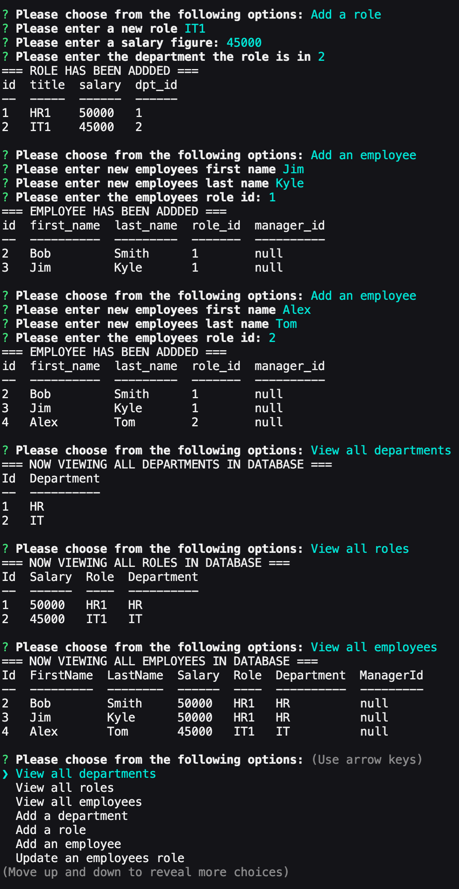

# Employee_Management_System

## Description

A interfaces that allow non-developers to easily view and interact with information stored in databases. It's a command-line application to manage a company's employee database.

## Usage

- [Video](https://youtu.be/zlQrZDvoFvo)

- [Github](https://github.com/ngolston/Weather-Dashboard)
- README.md

## Technology

- JS
- MySQL
- Node

## NPM

- dotenv
- inquirer
- mysql2

## Credits

- Dillan Mansor
- Davis Ransom
- Jeffrey Young
- Thao Nguyen
- Parisa Ostovari
- Caroline Pastorelli
- And Everyone Else 😁🙏🏾
